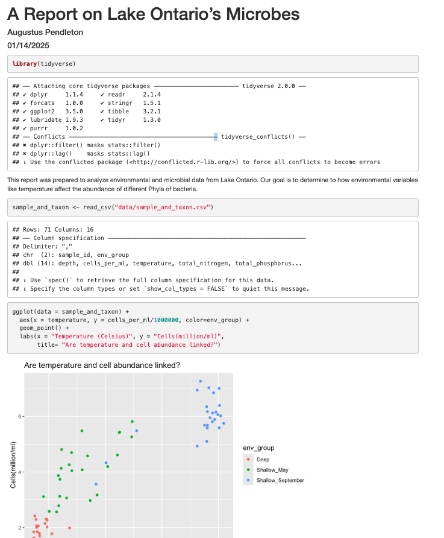

```{r setup, include=FALSE}
knitr::opts_chunk$set(echo = TRUE)
```

# Introduction

In this report, we will analyze how different water quality parameters affect the abundance of bacterial phyla.

# Set-up

## Loading Packages

First, we'll load necessary packages:

```{r packages, warning = FALSE, message = FALSE}
library(tidyverse)
```

## Reading in Data

Then, we'll read in our data. We produced this dataframe by joining the sample_data.csv and taxon_abundance.csv files using an innerjoin.

```{r data}
sample_and_taxon <- read_csv("data/sample_and_taxon.csv")
```

# Analyzing the Data

Finally, we'll plot the relationship between temperature and overall microbial cell abundance.

```{r cells_vs_temp, fig.width=2, fig.height = 1}
sample_and_taxon %>%
  ggplot() +
  aes(x = temperature,
      y = cells_per_ml/1e6,
      color = env_group) + 
  geom_point() + 
  labs(x = "Temperature (C)",
       y = "Cells (million/ml)",
       title = "Are temperature and cell abundance linked?")
```

It appears that wamer waters promote higher microbial cell counts. Cell counts were especially high in the warms waters of September.

```{r data_summary, include = FALSE}
nSamples <- nrow(sample_and_taxon)

minTemp <- sample_and_taxon %>%
  pull(temperature) %>%
  min() %>%
  round()

# Make an object call maxTemp which has the maximum temperature
maxTemp <- sample_and_taxon %>%
  pull(temperature) %>%
  max() %>%
  round()

```

The above plot shows `r nSamples` samples. For these samples, the minimum temp was `r minTemp`C and the maximum was `r maxTemp`C.

| Statistic         | Value        |
|-------------------|--------------|
| Number of Samples | `r nSamples` |
| Minimum Temp      | `r minTemp`  |
| Maximum Temp      | `r maxTemp`  |

```{r kable}
library(knitr)

sample_and_taxon %>%
  filter(env_group == "Deep") %>%
  select(cells_per_ml, temperature, Chloroflexi) %>%
  kable()
```

1.  *Markdown*
2.  **facet_wrap**
3.  ***SQL***

[Markdown Tutorial](https://marschmilab.github.io/Cornell_Carpentries_Jan2025/05-r-markdown/index.html)

Challenge: Make a bullet point list. First line is your favorite coding language so far - in italics Second line is your favorite function we've learned so far - bold Third line is the next programming thing you want to learn - italics and bold

Switch to a numbered list Find a markdown formatting tutorial and insert it as a hyperlink



@schmidt2010
